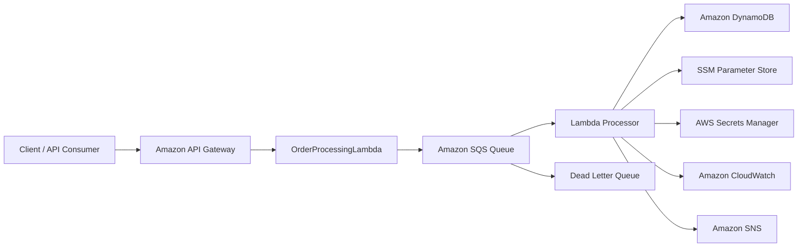

# AWS Lambda Order Processing Microservice


A serverless, event-driven order processing microservice built with Java 21, AWS Lambda, Amazon API Gateway, Amazon SQS, DynamoDB, SNS, SSM Parameter Store, Secrets Manager, CloudWatch, AWS SAM, and CloudFormation.

This project demonstrates a production-style AWS architecture where API Gateway accepts incoming requests, invokes Lambda functions, and pushes order events into asynchronous processing workflows.

## Features

- API Gateway entry point for client requests
- AWS Lambda-based business logic
- Asynchronous order processing with Amazon SQS
- Partial batch failure handling with DLQ support
- DynamoDB idempotency protection
- SSM Parameter Store and Secrets Manager integration
- CloudWatch logging and custom metrics
- SNS alerts and notifications
- GitHub Actions CI/CD with OIDC authentication
- Infrastructure as Code using AWS SAM / CloudFormation

## Architecture



## Request Flow

1. A client sends an order request through Amazon API Gateway.
2. API Gateway invokes the Lambda handler.
3. The Lambda validates and prepares the order payload.
4. The processed order is published to SQS for asynchronous handling.
5. The downstream Lambda worker stores the order in DynamoDB.
6. Metrics, logs, and notifications are emitted to CloudWatch and SNS.

## AWS Resources

The infrastructure provisions and manages:

- API Gateway
- Lambda
- SQS and DLQ
- DynamoDB
- SNS topics
- SSM Parameter Store
- Secrets Manager
- CloudWatch Logs and Alarms
- IAM roles and policies

## Deployment

This project is packaged and deployed with AWS SAM and CloudFormation. The deployment pipeline uses GitHub Actions and AWS OIDC authentication rather than long-lived AWS credentials.

## Project Structure

```text
.
├── .github/
│   └── workflows/
├── src/
│   ├── main/java/
│   └── test/java/
├── pom.xml
├── template.yaml
├── samconfig.toml
├── Readme.md
└── .gitignore
```

## Notes

The API Gateway layer allows the service to be exposed securely and consistently to external clients, while the Lambda + SQS architecture keeps the workload scalable, decoupled, and resilient.
