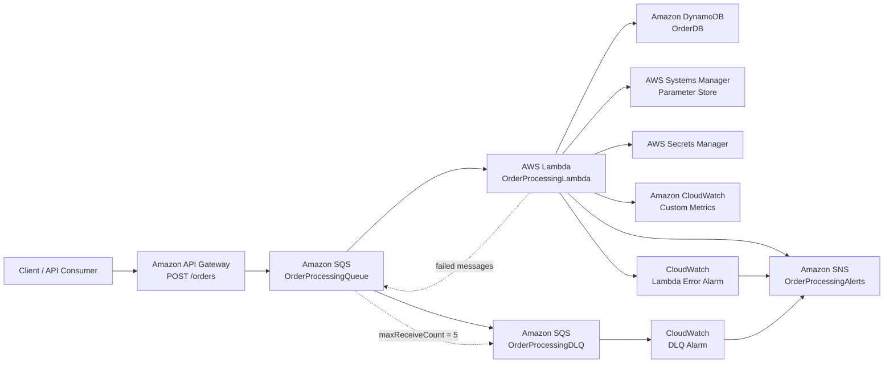

# AWS Lambda Order Processing Microservice


A serverless, event-driven order processing microservice built with **Java 21, AWS Lambda, Amazon API Gateway, Amazon SQS, DynamoDB, SNS, SSM Parameter Store, Secrets Manager, CloudWatch, AWS SAM and CloudFormation**.

The project demonstrates production-oriented AWS patterns including:

- Synchronous API Gateway integration with direct SQS messaging
- Asynchronous event-driven processing via SQS
- SQS batch processing
- Partial batch failure handling
- Dead Letter Queue (DLQ)
- DynamoDB idempotency protection
- Environment-specific infrastructure
- Parameter Store and Secrets Manager integration
- Custom CloudWatch metrics
- CloudWatch alarms
- SNS notifications
- GitHub Actions CI/CD
- GitHub OIDC authentication
- Infrastructure as Code using AWS SAM / CloudFormation

---

# Architecture

The application is deployed as a completely serverless workload in **AWS `ap-south-1`**.

## Request Path

1. **API Gateway** accepts HTTP POST requests at `/orders`
2. **API Gateway** directly sends the request body as a message to **Amazon SQS**
3. **Lambda** is triggered by SQS events asynchronously
4. **Lambda** processes the order message and persists it to **DynamoDB**

## High-Level Architecture



---

# API Gateway Integration

The API Gateway uses a direct SQS integration without invoking Lambda.

**Endpoint:**
```
POST https://{api-id}.execute-api.{region}.amazonaws.com/{environment}/orders
```

**Request Body:**
The JSON payload is sent directly as the SQS message body.

**Response:**
API Gateway returns the SQS MessageId immediately.

**Example Request:**
```bash
curl -X POST https://abc123.execute-api.us-east-1.amazonaws.com/dev/orders \
  -H "Content-Type: application/json" \
  -d '{
    "orderId": "ORDER-001",
    "customerId": "CUST-123",
    "amount": 99.99,
    "notify": true
  }'
```

---

# Order Processing Flow

After the message arrives in SQS, the Lambda function is triggered by the event source mapping.

The Lambda function:

1. Reads messages from SQS (in batches).
2. Deserializes each message into an `OrderRequest`.
3. Retrieves configuration from SSM Parameter Store.
4. Retrieves credentials from AWS Secrets Manager.
5. Stores the order in DynamoDB.
6. Publishes custom processing metrics to CloudWatch.
7. Optionally publishes an order notification to SNS.
8. Reports individual failed SQS messages back to Lambda.
9. Allows failed messages to be retried independently.
10. Eventually moves repeatedly failing messages to the DLQ.

---

# SQS Batch Processing

One of the important design decisions in this project is the use of:

```yaml
FunctionResponseTypes:
  - ReportBatchItemFailures
```

This allows Lambda to acknowledge successful messages while returning only failed message IDs for retry.

For example, if a batch contains five messages:

```text
Batch
├── Message 1 → SUCCESS
├── Message 2 → SUCCESS
├── Message 3 → FAILURE
├── Message 4 → SUCCESS
└── Message 5 → SUCCESS
```

Lambda returns:

```text
BatchItemFailures
└── Message 3
```

Therefore only Message 3 is retried.

### Why partial batch failure matters

Without partial batch failure reporting, one failed message could cause the entire batch to be retried.

With:

```yaml
FunctionResponseTypes:
  - ReportBatchItemFailures
```

successful messages don't need to be processed again.

This reduces:

- Duplicate processing
- Unnecessary DynamoDB writes
- Lambda execution
- Retry traffic
- Overall processing cost

---

# Retry and Dead Letter Queue

The main queue is configured with:

```yaml
RedrivePolicy:
  deadLetterTargetArn: !GetAtt OrderDlq.Arn
  maxReceiveCount: 5
```

The processing flow is therefore:

- **Visibility Timeout:** 180 seconds
- **Message Retention:** 4 days
- **Maximum Receive Count:** 5
- **DLQ Retention:** 14 days
- **Batch Size:** 5 messages
- **Maximum Batching Window:** 5 seconds

---

# DynamoDB Persistence

Orders are stored in:

```text
OrderDB-{environment}
```

The table uses:

```yaml
BillingMode: PAY_PER_REQUEST
```

and:

```text
Partition Key: OrderId (String)
```

The Lambda writes:

```text
OrderId
CustomerId
Amount
Notify
```

## Idempotency protection

The DynamoDB operation uses:

```java
conditionExpression("attribute_not_exists(OrderId)")
```

This prevents an existing order from being overwritten when the same `OrderId` is processed again.

---

# Configuration and Secrets

The application intentionally separates normal configuration from sensitive credentials.

## AWS Systems Manager Parameter Store

Used for environment-specific configuration.

Parameter:

```text
/order-processing/{environment}/downstream-url
```

---

## AWS Secrets Manager

Sensitive credentials are stored in:

```text
/order-processing/{environment}/order-service-secret
```

---

# Notifications and Alerts

Amazon SNS is used for infrastructure alerts and order notifications.

The topic is:

```text
OrderProcessingAlerts-{environment}
```

SNS publishes:

1. Application-level order notifications
2. Infrastructure/operational alerts from CloudWatch alarms

---

# Observability

The application uses Amazon CloudWatch for both logs and metrics.

## Lambda Logs

Log group:

```text
/aws/lambda/OrderProcessingLambda-{environment}
```

---

## Custom Metrics

The Lambda publishes:

```text
Metric Namespace: OrderProcessing
Metric: ProcessingEvents
Dimension: OrderStatus (Success | Failure)
```

---

# CloudWatch Alarms

Two infrastructure alarms are configured.

## Lambda Error Alarm

```text
OrderProcessingLambda-Errors-{environment}
```

Triggers on **1 or more errors** in a 5-minute period.

---

## DLQ Alarm

```text
OrderProcessingDLQ-Messages-{environment}
```

Triggers when **1 or more messages** are visible in the DLQ over a 5-minute period.

Both alarms publish to the SNS alert topic for email notification.

---

# Deployment Environments

The infrastructure supports three environments.

| Environment | Memory | Timeout | Batch Size | Max Concurrency | Log Retention | Log Level |
|---|---:|---:|---:|---:|---:|---|
| DEV | 512 MB | 30s | 5 | 5 | 30 days | DEBUG |
| STAGING | 512 MB | 30s | 5 | 10 | 30 days | INFO |
| PROD | 1024 MB | 30s | 10 | 20 | 90 days | WARN |

Production also uses:

```text
DownstreamTimeout = 3000 ms
```

while DEV and STAGING use:

```text
DownstreamTimeout = 5000 ms
```

---

# Infrastructure as Code

The infrastructure is defined using:

```text
AWS SAM
+
AWS CloudFormation
```

The main infrastructure file is:

```text
template.yaml
```

The project uses CloudFormation to manage:

- API Gateway (HTTP API with SQS integration)
- Lambda
- SQS
- SQS DLQ
- DynamoDB
- SNS
- SNS subscription
- SSM Parameter
- Secrets Manager
- CloudWatch Log Group
- CloudWatch Alarms
- IAM permissions

---

# Project Structure

```text
.
├── .github/
│   └── workflows/
│       ├── aws-auth-test.yml
│       ├── deploy.yml
│       ├── deploy-dev.yml
│       ├── deploy-staging.yml
│       └── deploy-prod.yml
│
├── src/
│   ├── main/
│   │   ├── java/
│   │   │   └── com/
│   │   │       └── example/
│   │   │           ├── Config/
│   │   │           │   ├── ParameterStoreConfig.java
│   │   │           │   └── SecretsManagerConfig.java
│   │   │           │
│   │   │           ├── Database/
│   │   │           │   └── DynamoDBHandler.java
│   │   │           │
│   │   │           ├── Entity/
│   │   │           │   └── OrderRequest.java
│   │   │           │
│   │   │           ├── Enums/
│   │   │           │   └── OrderStatusEnum.java
│   │   │           │
│   │   │           ├── Metrics/
│   │   │           │   └── CloudWatchMetricsHandler.java
│   │   │           │
│   │   │           ├── Notification/
│   │   │           │   └── SnsHandler.java
│   │   │           │
│   │   │           └── OrderLambdaHandler.java
│   │   │
│   │   └── resources/
│   │       ├── cloudformation-deployment-policy.json
│   │       ├── cloudformation-trust-policy.json
│   │       ├── github-actions-permissions-policy.json
│   │       └── github-actions-trust-policy.json
│   │
│   └── test/
│       └── java/
│
├── template.yaml
├── samconfig.toml
├── pom.xml
└── Readme.md
```

---

# Core Java Components

## `OrderLambdaHandler`

Main Lambda entry point:

```text
com.example.OrderLambdaHandler::handleRequest
```

Implements:

```java
RequestHandler<SQSEvent, SQSBatchResponse>
```

Responsibilities:

- Read SQS events
- Deserialize order messages
- Retrieve configuration
- Retrieve secrets
- Persist orders
- Publish metrics
- Publish SNS notifications
- Track individual message failures
- Return `SQSBatchResponse`

---

## `DynamoDBHandler`

Responsible for order persistence.

Uses AWS SDK for Java and performs:

```text
PutItem
```

with:

```text
attribute_not_exists(OrderId)
```

to provide duplicate protection.

---

## `ParameterStoreConfig`

Retrieves environment-specific configuration from SSM Parameter Store.

---

## `SecretsManagerConfig`

Retrieves sensitive credentials from AWS Secrets Manager.

---

## `CloudWatchMetricsHandler`

Publishes application-level processing metrics.

---

## `SnsHandler`

Publishes order notifications to the SNS topic.

---

# Failure Handling

The system has multiple layers of failure handling:

1. **API Gateway** → **SQS:** Direct integration, immediate response to client
2. **SQS** → **Lambda:** Batch processing with partial failure reporting
3. **Lambda Retry:** Individual failed messages are retried (max 5 times)
4. **DLQ:** Permanently failed messages are moved to the Dead Letter Queue
5. **CloudWatch Alarms:** DLQ and Lambda errors trigger SNS notifications

This gives the system:

- Immediate API response while processing asynchronously
- Per-message failure reporting
- Automatic retries
- Dead-letter isolation
- Operational alerting

---

# CI/CD Architecture

The project uses GitHub Actions with **AWS OIDC authentication** rather than storing long-lived AWS access keys.

The deployment pipeline builds the application once and promotes the packaged artifact through:

```text
DEV
 ↓
STAGING
 ↓
PROD
```

---

# Scalability

The Lambda event source mapping supports configurable concurrency.

DEV: **MaximumConcurrency = 5**
STAGING: **MaximumConcurrency = 10**
PROD: **MaximumConcurrency = 20**

The architecture can therefore process multiple SQS batches concurrently while placing an upper bound on Lambda concurrency.
