# AWS Lambda Order Processing Microservice


A serverless, event-driven order processing microservice built with **Java 21, AWS Lambda, Amazon SQS, DynamoDB, SNS, SSM Parameter Store, Secrets Manager, CloudWatch, AWS SAM and CloudFormation**.

The project demonstrates production-oriented AWS patterns including:

- Event-driven asynchronous processing
- SQS batch processing
- Partial batch failure handling
- Dead Letter Queue (DLQ)
- DynamoDB idempotency protection
- Environment-specific infrastructure
- Parameter Store and Secrets Manager integration
- Custom CloudWatch metrics
- CloudWatch alarms
- SNS notifications
- GitHub Actions CI/CD
- GitHub OIDC authentication
- Infrastructure as Code using AWS SAM / CloudFormation

---

# Architecture

The application is deployed as a completely serverless workload in **AWS `ap-south-1`**.

Orders enter Amazon SQS and are processed asynchronously by a Java 21 Lambda function.

The Lambda function:

1. Reads messages from SQS.
2. Deserializes each message into an `OrderRequest`.
3. Retrieves configuration from SSM Parameter Store.
4. Retrieves credentials from AWS Secrets Manager.
5. Stores the order in DynamoDB.
6. Publishes custom processing metrics to CloudWatch.
7. Optionally publishes an order notification to SNS.
8. Reports individual failed SQS messages back to Lambda.
9. Allows failed messages to be retried independently.
10. Eventually moves repeatedly failing messages to the DLQ.

## High-Level Architecture

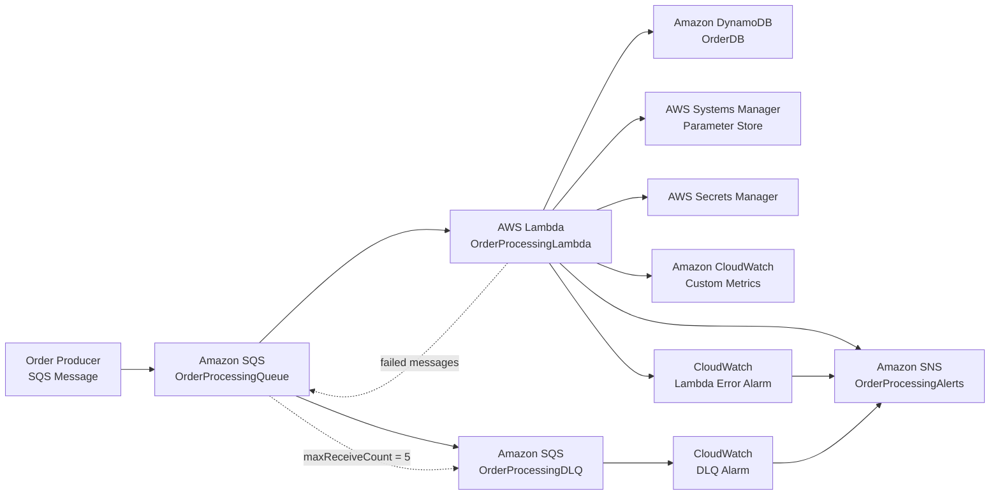

---

# Order Processing Flow

The Lambda function is triggered by an SQS event source mapping.

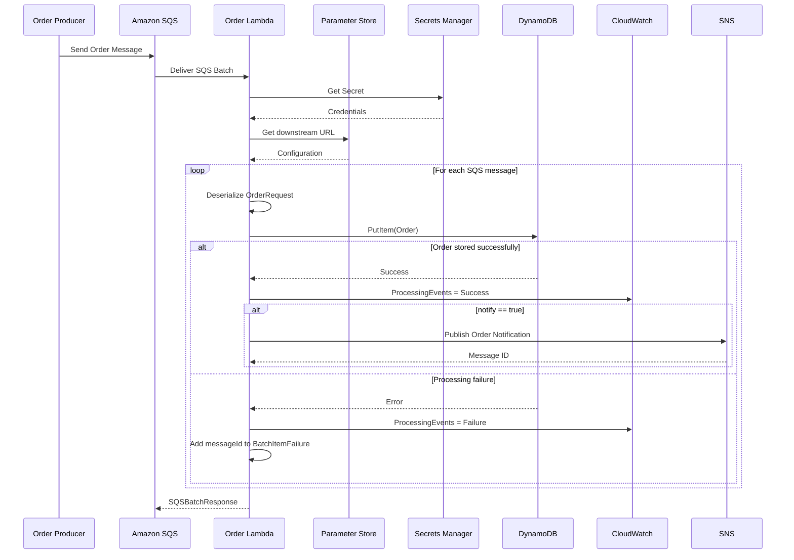

---

# SQS Batch Processing

One of the important design decisions in this project is the use of:

```yaml
FunctionResponseTypes:
  - ReportBatchItemFailures
```

This allows Lambda to acknowledge successful messages while returning only failed message IDs for retry.

For example, if a batch contains five messages:

```text
Batch
├── Message 1 → SUCCESS
├── Message 2 → SUCCESS
├── Message 3 → FAILURE
├── Message 4 → SUCCESS
└── Message 5 → SUCCESS
```

Lambda returns:

```text
BatchItemFailures
└── Message 3
```

Therefore only Message 3 is retried.

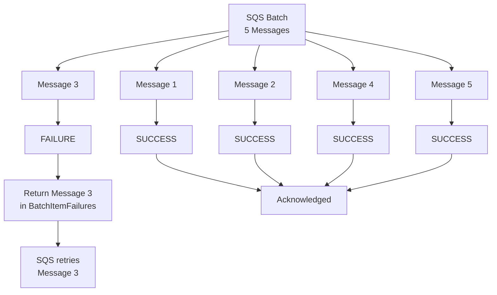

### Why partial batch failure matters

Without partial batch failure reporting, one failed message could cause the entire batch to be retried.

With:

```yaml
FunctionResponseTypes:
  - ReportBatchItemFailures
```

successful messages don't need to be processed again.

This reduces:

- Duplicate processing
- Unnecessary DynamoDB writes
- Lambda execution
- Retry traffic
- Overall processing cost

---

# Retry and Dead Letter Queue

The main queue is configured with:

```yaml
RedrivePolicy:
  deadLetterTargetArn: !GetAtt OrderDlq.Arn
  maxReceiveCount: 5
```

The processing flow is therefore:

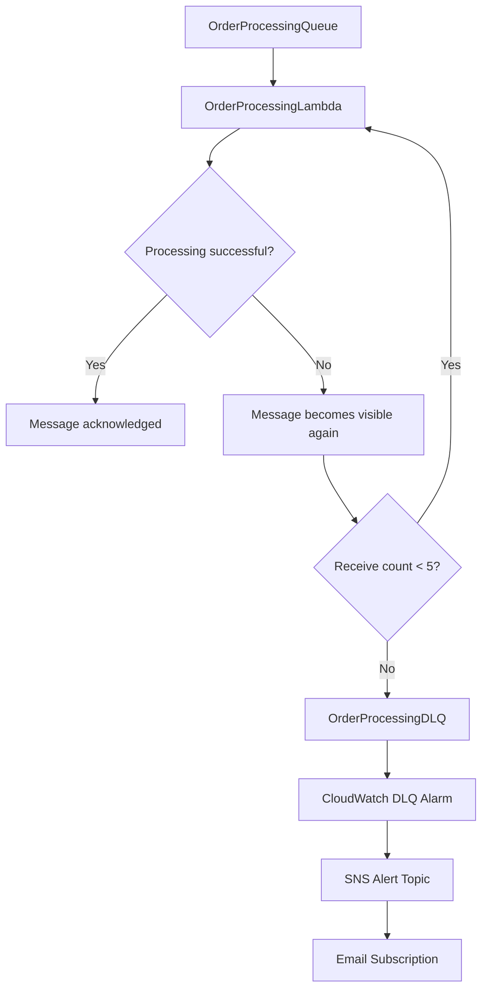

### Retry configuration

| Setting | Value |
|---|---:|
| Main queue visibility timeout | 180 seconds |
| Main queue retention | 4 days |
| Maximum receive count | 5 |
| DLQ retention | 14 days |
| Default batch size | 5 |
| Maximum batching window | 5 seconds |
| Default maximum concurrency | 5 |

---

# DynamoDB Persistence

Orders are stored in:

```text
OrderDB-{environment}
```

For example:

```text
OrderDB-dev
OrderDB-staging
OrderDB-prod
```

The table uses:

```yaml
BillingMode: PAY_PER_REQUEST
```

and:

```text
Partition Key:
OrderId (String)
```

The Lambda writes:

```text
OrderId
CustomerId
Amount
Notify
```

## Idempotency protection

The DynamoDB operation uses:

```java
conditionExpression("attribute_not_exists(OrderId)")
```

This prevents an existing order from being overwritten when the same `OrderId` is processed again.

Conceptually:

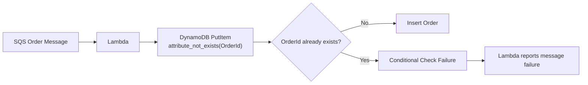

This is particularly useful when messages are retried.

---

# Configuration and Secrets

The application intentionally separates normal configuration from sensitive credentials.

## AWS Systems Manager Parameter Store

Used for environment-specific configuration.

Parameter:

```text
/order-processing/{environment}/downstream-url
```

Examples:

```text
/order-processing/dev/downstream-url
/order-processing/staging/downstream-url
/order-processing/prod/downstream-url
```

The Lambda receives the parameter name through:

```text
DOWNSTREAM_URL_PARAMETER
```

---

## AWS Secrets Manager

Sensitive credentials are stored in:

```text
/order-processing/{environment}/order-service-secret
```

The secret contains a generated password and service username.

The Lambda receives the secret reference through:

```text
ORDER_SERVICE_SECRET_ARN
```

Architecture:

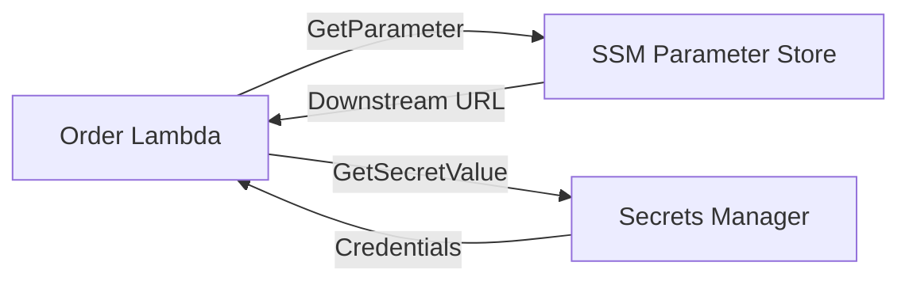

### Important distinction

```text
SSM Parameter Store
        ↓
Application configuration

Secrets Manager
        ↓
Sensitive credentials
```

---

# Notifications

Amazon SNS is used for order notifications and infrastructure alerts.

The topic is:

```text
OrderProcessingAlerts-{environment}
```

For an order where:

```text
notify = true
```

the Lambda publishes a notification to SNS.

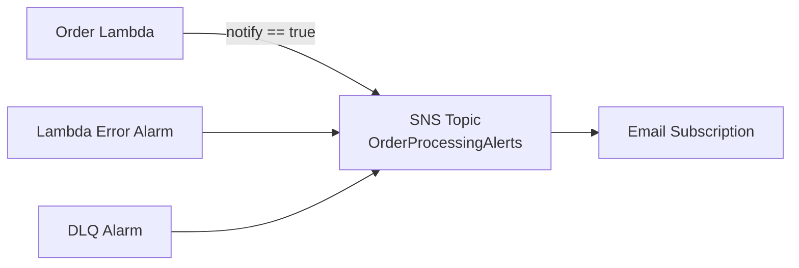

SNS therefore has two major roles:

1. Application-level order notifications
2. Infrastructure/operational alerts

---

# Observability

The application uses Amazon CloudWatch for both logs and metrics.

## Lambda Logs

Log group:

```text
/aws/lambda/OrderProcessingLambda-{environment}
```

Log retention is environment-specific.

```text
DEV     → 30 days
STAGING → 30 days
PROD    → 90 days
```

---

## Custom Metrics

The Lambda publishes:

```text
Metric Namespace:
OrderProcessing
```

using the configured `APPLICATION_NAME`.

Metric:

```text
ProcessingEvents
```

Dimension:

```text
OrderStatus
```

Possible values:

```text
Success
Failure
```

Architecture:

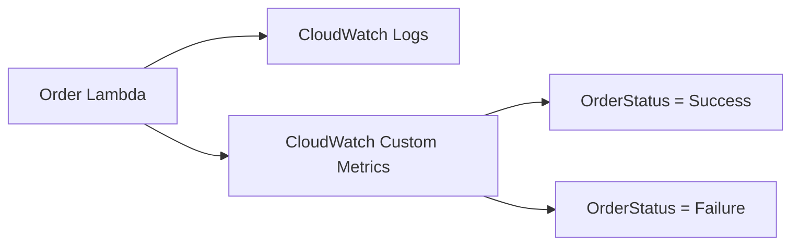

---

# CloudWatch Alarms

Two infrastructure alarms are configured.

## Lambda Error Alarm

```text
OrderProcessingLambda-Errors-{environment}
```

Configuration:

```text
Metric:
AWS/Lambda → Errors

Period:
5 minutes

Threshold:
>= 1

Evaluation Periods:
1
```

---

## DLQ Alarm

```text
OrderProcessingDLQ-Messages-{environment}
```

Configuration:

```text
Metric:
AWS/SQS → ApproximateNumberOfMessagesVisible

Period:
5 minutes

Threshold:
>= 1

Evaluation Periods:
1
```

Both alarms publish to the SNS alert topic.

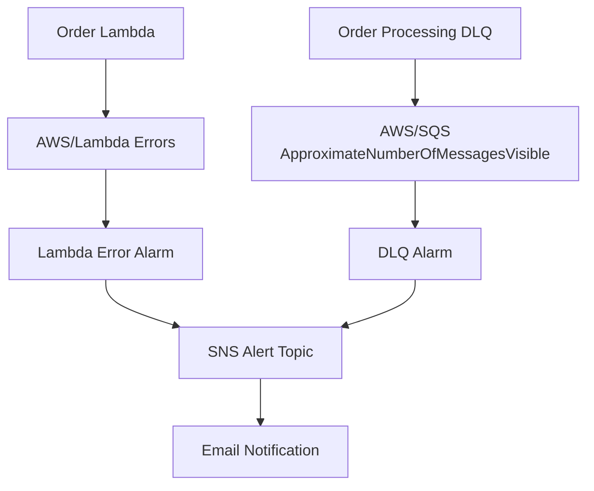

---

# AWS Resource Architecture

The complete infrastructure consists of:

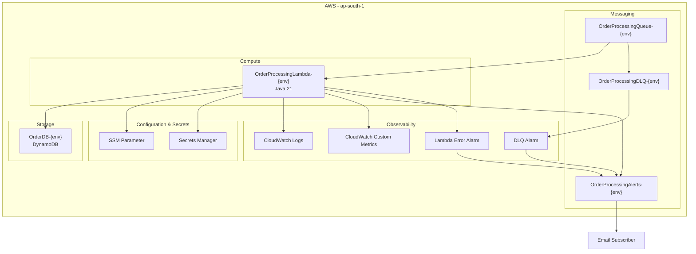

---

# CI/CD Architecture

The project uses GitHub Actions with **AWS OIDC authentication** rather than storing long-lived AWS access keys.

The deployment pipeline builds the application once and promotes the packaged artifact through:

```text
DEV
 ↓
STAGING
 ↓
PROD
```

```mermaid
flowchart LR

    Developer["Developer"]

    Developer --> GitHub["GitHub Repository"]

    GitHub --> Actions["GitHub Actions"]

    Actions --> Checkout["Checkout"]

    Checkout --> Java["Setup Java 21"]

    Java --> Tests["Maven Tests"]

    Tests --> Validate["SAM Validate"]

    Validate --> Build["SAM Build"]

    Build --> Package["SAM Package"]

    Package --> Artifact["Packaged SAM Artifact"]

    Artifact --> Dev["Deploy DEV"]

    Dev --> Staging["Deploy STAGING"]

    Staging --> Prod["Deploy PROD"]

    Actions -. OIDC .-> AWS["AWS IAM<br/>GitHubActionsDeployRole"]

    AWS --> Dev
    AWS --> Staging
    AWS --> Prod

    Prod --> CloudFormation["CloudFormation Deployment Role"]

    CloudFormation --> Resources["AWS Infrastructure"]
```

---

# CI/CD Security

GitHub Actions uses:

```yaml
permissions:
  id-token: write
  contents: read
```

AWS credentials are obtained using GitHub's OIDC federation.

The pipeline assumes:

```text
GitHubActionsDeployRole
```

and deployment is performed through:

```text
CloudFormationDeploymentRole
```

This avoids storing long-lived AWS access keys in GitHub Secrets.

---

# Deployment Environments

The infrastructure supports three environments.

| Environment | Memory | Timeout | Batch Size | Max Concurrency | Log Retention | Log Level |
|---|---:|---:|---:|---:|---:|---|
| DEV | 512 MB | 30s | 5 | 5 | 30 days | DEBUG |
| STAGING | 512 MB | 30s | 5 | 10 | 30 days | INFO |
| PROD | 1024 MB | 30s | 10 | 20 | 90 days | WARN |

Production also uses:

```text
DownstreamTimeout = 3000 ms
```

while DEV and STAGING use:

```text
DownstreamTimeout = 5000 ms
```

---

# Infrastructure as Code

The infrastructure is defined using:

```text
AWS SAM
+
AWS CloudFormation
```

The main infrastructure file is:

```text
template.yaml
```

SAM expands the serverless resources into CloudFormation resources.

The project uses CloudFormation to manage:

- Lambda
- SQS
- SQS DLQ
- DynamoDB
- SNS
- SNS subscription
- SSM Parameter
- Secrets Manager
- CloudWatch Log Group
- CloudWatch Alarms
- IAM permissions

---

# Project Structure

```text
.
├── .github/
│   └── workflows/
│       ├── aws-auth-test.yml
│       ├── deploy.yml
│       ├── deploy-dev.yml
│       ├── deploy-staging.yml
│       └── deploy-prod.yml
│
├── src/
│   ├── main/
│   │   ├── java/
│   │   │   └── com/
│   │   │       └── example/
│   │   │           ├── Config/
│   │   │           │   ├── ParameterStoreConfig.java
│   │   │           │   └── SecretsManagerConfig.java
│   │   │           │
│   │   │           ├── Database/
│   │   │           │   └── DynamoDBHandler.java
│   │   │           │
│   │   │           ├── Entity/
│   │   │           │   └── OrderRequest.java
│   │   │           │
│   │   │           ├── Enums/
│   │   │           │   └── OrderStatusEnum.java
│   │   │           │
│   │   │           ├── Metrics/
│   │   │           │   └── CloudWatchMetricsHandler.java
│   │   │           │
│   │   │           ├── Notification/
│   │   │           │   └── SnsHandler.java
│   │   │           │
│   │   │           └── OrderLambdaHandler.java
│   │   │
│   │   └── resources/
│   │       ├── cloudformation-deployment-policy.json
│   │       ├── cloudformation-trust-policy.json
│   │       ├── github-actions-permissions-policy.json
│   │       └── github-actions-trust-policy.json
│   │
│   └── test/
│       └── java/
│
├── template.yaml
├── samconfig.toml
├── pom.xml
└── Readme.md
```

---

# Core Java Components

## `OrderLambdaHandler`

Main Lambda entry point:

```text
com.example.OrderLambdaHandler::handleRequest
```

Implements:

```java
RequestHandler<SQSEvent, SQSBatchResponse>
```

Responsibilities:

- Read SQS events
- Deserialize order messages
- Retrieve configuration
- Retrieve secrets
- Persist orders
- Publish metrics
- Publish SNS notifications
- Track individual message failures
- Return `SQSBatchResponse`

---

## `DynamoDBHandler`

Responsible for order persistence.

Uses AWS SDK for Java and performs:

```text
PutItem
```

with:

```text
attribute_not_exists(OrderId)
```

to provide duplicate protection.

---

## `ParameterStoreConfig`

Retrieves environment-specific configuration from SSM Parameter Store.

---

## `SecretsManagerConfig`

Retrieves sensitive credentials from AWS Secrets Manager.

---

## `CloudWatchMetricsHandler`

Publishes application-level processing metrics.

---

## `SnsHandler`

Publishes order notifications to the SNS topic.

---

# Failure Handling

The system has multiple layers of failure handling.

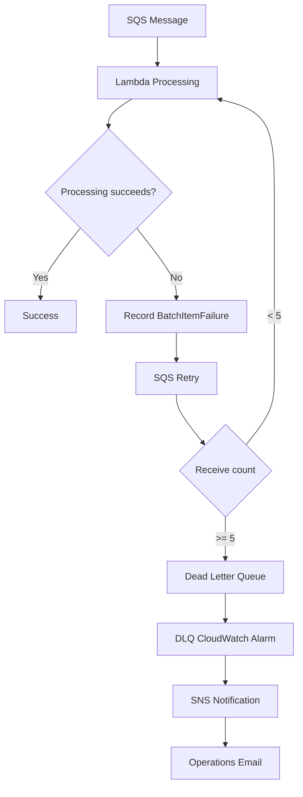

This gives the system:

- Automatic retries
- Per-message failure reporting
- Dead-letter isolation
- Operational alerting

---

# Scalability

The Lambda event source mapping supports configurable concurrency.

DEV:

```text
MaximumConcurrency = 5
```

STAGING:

```text
MaximumConcurrency = 10
```

PROD:

```text
MaximumConcurrency = 20
```

The architecture can therefore process multiple SQS batches concurrently while placing an upper bound on Lambda concurrency.

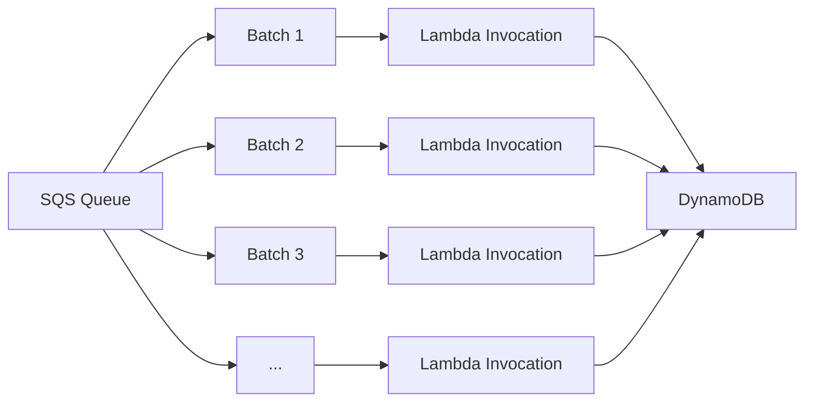

---

# Data Flow Summary

```text
Order Producer
      │
      ▼
Amazon SQS
      │
      ▼
AWS Lambda
      │
      ├──────────────► DynamoDB
      │
      ├──────────────► SSM Parameter Store
      │
      ├──────────────► Secrets Manager
      │
      ├──────────────► CloudWatch Metrics
      │
      └──────────────► SNS
                           │
                           ▼
                         Email

SQS
 │
 └── failed after retries
          │
          ▼
         DLQ
          │
          ▼
     CloudWatch Alarm
          │
          ▼
         SNS
          │
          ▼
        Email
```

---

# Environment Isolation

Each environment gets its own AWS resources.

For example:

```text
DEV

OrderProcessingQueue-dev
OrderProcessingDLQ-dev
OrderDB-dev
OrderProcessingLambda-dev
OrderProcessingAlerts-dev
```

STAGING:

```text
OrderProcessingQueue-staging
OrderProcessingDLQ-staging
OrderDB-staging
OrderProcessingLambda-staging
OrderProcessingAlerts-staging
```

PROD:

```text
OrderProcessingQueue-prod
OrderProcessingDLQ-prod
OrderDB-prod
OrderProcessingLambda-prod
OrderProcessingAlerts-prod
```

This prevents the environments from sharing the same application data and messaging infrastructure.

---

# DynamoDB Deletion Protection

The DynamoDB table is intentionally protected using:

```yaml
DeletionPolicy: Retain
UpdateReplacePolicy: Retain
```

and:

```yaml
DeletionProtectionEnabled: true
```

This provides an additional safeguard against accidentally deleting production order data during CloudFormation/SAM stack operations.

As a result, deleting the CloudFormation stack does **not** mean the DynamoDB table is automatically deleted.

The table must be explicitly handled separately when permanent deletion is intended.

---

# Build Locally

## Prerequisites

Install:

- Java 21
- Maven
- AWS CLI
- AWS SAM CLI
- Docker
- AWS credentials with appropriate permissions

Verify Java:

```bash
java -version
```

Verify Maven:

```bash
mvn -version
```

Verify SAM:

```bash
sam --version
```

---

# Run Tests

```bash
mvn test
```

---

# Validate SAM Template

```bash
sam validate
```

For linting:

```bash
sam validate --lint
```

---

# Build

```bash
sam build
```

---

# Deploy

DEV:

```bash
sam deploy --config-env dev
```

STAGING:

```bash
sam deploy --config-env staging
```

PROD:

```bash
sam deploy --config-env prod
```

---

# Deployment Architecture

The complete deployment process is:

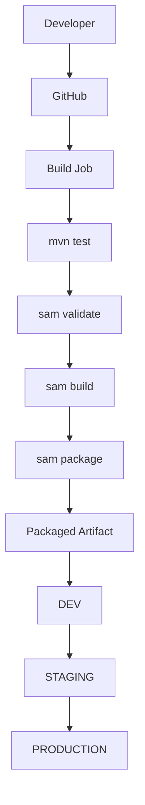

---

# Technology Stack

| Technology | Purpose |
|---|---|
| Java 21 | Lambda runtime |
| AWS Lambda | Serverless compute |
| Amazon SQS | Asynchronous messaging |
| Amazon SQS DLQ | Failed message isolation |
| DynamoDB | Order persistence |
| SNS | Notifications and alerts |
| SSM Parameter Store | Application configuration |
| Secrets Manager | Sensitive credentials |
| CloudWatch Logs | Application logging |
| CloudWatch Metrics | Application metrics |
| CloudWatch Alarms | Operational monitoring |
| AWS SAM | Serverless IaC |
| CloudFormation | Infrastructure provisioning |
| Maven | Java build and dependency management |
| GitHub Actions | CI/CD |
| GitHub OIDC | Keyless AWS authentication |

---

# Key Design Decisions

## Why SQS?

SQS decouples order producers from order processing.

The producer does not need to wait for the Lambda processing to finish.

This provides:

- Asynchronous processing
- Automatic retries
- Buffering during traffic spikes
- Failure isolation
- DLQ support

---

## Why Lambda?

Lambda provides serverless compute without requiring EC2 instances or container management.

The function scales according to SQS workload.

---

## Why DynamoDB?

DynamoDB provides a highly scalable serverless persistence layer and integrates naturally with Lambda.

`PAY_PER_REQUEST` billing is used so capacity does not need to be manually provisioned.

---

## Why Partial Batch Failure?

`ReportBatchItemFailures` prevents successful messages from being unnecessarily retried when another message in the same batch fails.

---

## Why a DLQ?

The DLQ prevents permanently failing messages from continuously circulating through the main queue.

It also provides a clear operational signal that requires investigation.

---

## Why Parameter Store and Secrets Manager?

Configuration and secrets have different security requirements.

```text
SSM Parameter Store
→ Configuration

Secrets Manager
→ Sensitive credentials
```

---

## Why GitHub OIDC?

GitHub Actions can authenticate to AWS using short-lived credentials rather than storing permanent AWS access keys.

This reduces credential-management risk.

---

# AWS Resources

The SAM template provisions the following major resources:

```text
AWS::SQS::Queue
    ├── OrderQueue
    └── OrderDlq

AWS::DynamoDB::Table
    └── OrderDB

AWS::Serverless::Function
    └── OrderLambda

AWS::Logs::LogGroup
    └── OrderLambdaLogGroup

AWS::CloudWatch::Alarm
    ├── OrderLambdaErrorAlarm
    └── OrderDlqAlarm

AWS::SSM::Parameter
    └── OrderServiceUrlParameter

AWS::SecretsManager::Secret
    └── OrderServiceSecret

AWS::SNS::Topic
    └── OrderProcessingAlertsTopic

AWS::SNS::Subscription
    └── OrderProcessingAlertsSubscription
```

---

# Project Goals

This project demonstrates several real-world AWS engineering concepts:

- Serverless application architecture
- Event-driven processing
- Asynchronous messaging
- SQS batch processing
- Partial batch failure handling
- Retry strategies
- Dead Letter Queues
- Idempotent database writes
- Infrastructure as Code
- Environment isolation
- Secure secret management
- Observability
- CloudWatch alerting
- SNS notifications
- CI/CD
- GitHub OIDC
- Java AWS SDK integration

---

# Future Improvements

Potential future enhancements include:

- Add automated SQS message generation for DEV
- Add integration tests against LocalStack
- Add structured JSON logging
- Add AWS X-Ray tracing
- Add CloudWatch dashboard
- Add DLQ replay tooling
- Add automated deployment approval gates
- Add automated security scanning
- Add dependency vulnerability scanning
- Add contract testing
- Add API Gateway if synchronous HTTP access is required
- Add downstream service integration
- Add infrastructure cost monitoring

---

# Cleanup

Before deleting an environment, understand that DynamoDB is intentionally protected.

The CloudFormation stack can be removed while the DynamoDB table remains retained.

If the DynamoDB table is no longer required, it must be explicitly deleted after ensuring that the data is no longer needed.

Always verify the AWS resources before performing cleanup in production.

---

# Architecture at a Glance

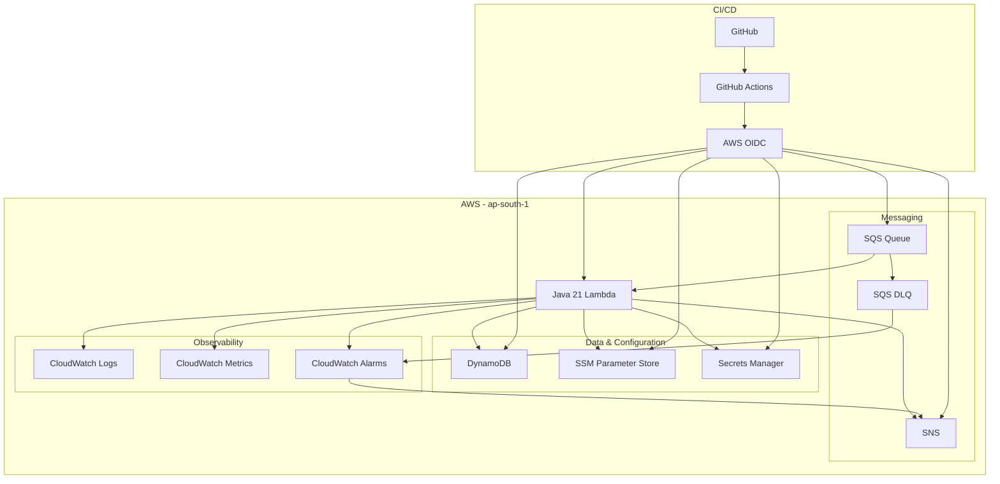

---

## Summary

This project implements a **serverless, asynchronous order-processing system** using AWS Lambda and SQS.

The core processing path is:

```text
SQS
 ↓
Lambda
 ↓
DynamoDB
```

with supporting infrastructure:

```text
SSM Parameter Store
Secrets Manager
CloudWatch
SNS
DLQ
```

and an automated deployment path:

```text
GitHub
 ↓
GitHub Actions
 ↓
AWS OIDC
 ↓
SAM / CloudFormation
 ↓
DEV → STAGING → PROD
```

The architecture is designed around **decoupling, retryability, failure isolation, observability, environment isolation and infrastructure-as-code**.
